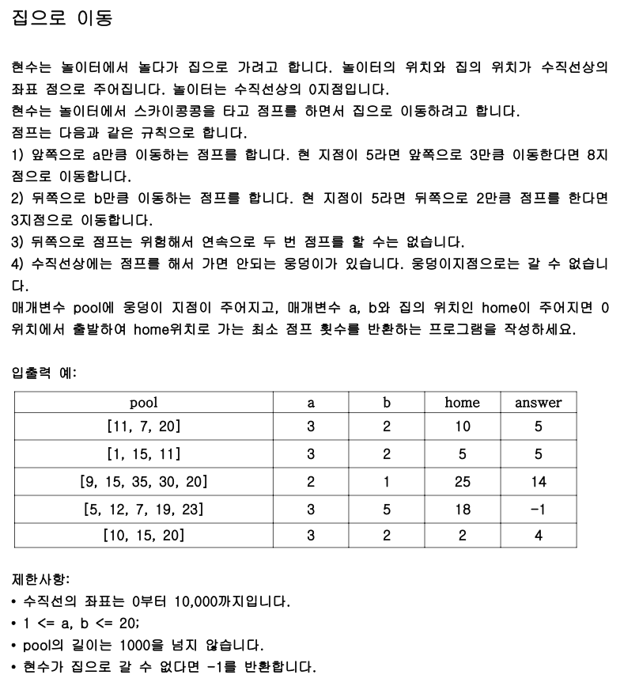

# 문제


# 풀이
- ch 배열을 두 개를 쓰거나, 2차원으로 사용해야 하는 문제
  - 앞으로 와서 체크를 한 경우와, 뒤로 와서 체크한 경우를 구분해야 한다.
  - 뒤로 온 적은 없지만, 이미 앞으로 와서 체크가 된 경우에도 뻗을 필요가 없다는 것에 유의.
  - 앞으로 온 적은 없지만, 이미 뒤로 와서 체크가 된 경우에는 앞으로 온 경우 뻗어야 한다.
    - 뒤로 갈 수 있는 새로운 경로가 나오기 때문
    - 앞으로 가는 경로는 겹치겠지만, 그 때가서 체크배열 보고 추가로 안 뻗게 되므로 큰 문제 없다.
- BFS를 돌 큐에도 앞으로 왔는지 뒤로 왔는지를 알려주기 위해 배열을 저장해야 한다.
```java
import java.util.*;
class Solution {
    public int solution(int[] pool, int a, int b, int home){
        Set<Integer> poolSet = new HashSet<>();
        for (int p : pool) {
            poolSet.add(p);
        }

        // ch[x][0] : 앞으로 온 것 -> 여기가 true이면 뒤로 왔든 앞으로 왔든 안 뻗는다.
        // ch[x][1] : 뒤로 온 것 -> ch[x][0]가 false && ch[x][1]가 true면, 앞으로 왔을 경우에만 뻗는다.
        boolean[][] ch = new boolean[10001][2];

        // arr[0] : 위치 값
        // arr[1] : 0이면 앞으로 온 것, 1이면 뒤로 온 것
        Queue<int[]> q = new LinkedList<>();
        q.offer(new int[]{0, 0});
        ch[0][0] = true;
        int L = 0;
        while(!q.isEmpty()) {
            int len = q.size();
            for (int i = 0; i < len; i++) {
                int[] poll = q.poll();
                int cur = poll[0];
                int front = poll[1];
                int next = cur + a;
                if (next <= 10000 && !ch[next][0] && !poolSet.contains(next)) {
                    if (next == home) {
                        return L + 1;
                    }
                    ch[next][0] = true;
                    q.offer(new int[]{next, 0});
                }
                if (front == 0) {
                    next = cur - b;
                    if (next >= 0 && !ch[next][0] && !ch[next][1] && !poolSet.contains(next)) {
                        if (next == home) {
                            return L + 1;
                        }
                        ch[next][1] = true;
                        q.offer(new int[]{next, 1});
                    }
                }
            }
            L++;
        }

        return -1;
    }

    public static void main(String[] args){
        Solution T = new Solution();
        System.out.println(T.solution(new int[]{11, 7, 20}, 3, 2, 10));
        System.out.println(T.solution(new int[]{1, 15, 11}, 3, 2, 5));
        System.out.println(T.solution(new int[]{9, 15, 35, 30, 20}, 2, 1, 25));
        System.out.println(T.solution(new int[]{5, 12, 7, 19, 23}, 3, 5, 18));
        System.out.println(T.solution(new int[]{10, 15, 20}, 3, 2, 2));
    }
}

```
