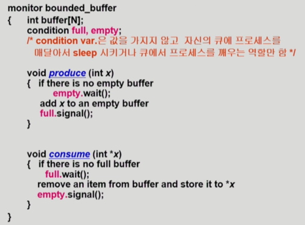
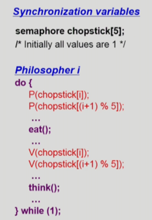

### Race Condition
- 여러 프로세스들이 동시에 공유 데이터를 접근하는 상황
  - 데이터의 최종 연산 결과는 마지막에 그 데이터를 다룬 프로세스에 따라 달라진다.
- S-box를 공유하는 E-box가 여럿 있는 경우 발생 가능
  - 예를 들어 count++은 instruction level로 분리되면, Load, Inc, Store 세 가지 단계로 분리된다.
  - 프로세스1이 Load를 수행한 뒤 컨텍스트 스위치가 일어나 프로세스2가 같은 데이터에 대해 count++을 하고 프로세스1로 CPU가 돌아오면, race condition 발생
- 프로세스들은 일반적으로 독립적인 주소공간을 사용하므로 Race Condition이 자주 발생하지는 않는다.
- Race Condition이 발생하는 경우
  - 하나의 프로세스가 커널모드에서 동작 중, 컨텍스트 스위치가 일어나 다른 프로세스에게 CPU를 빼앗기고, 그 프로세스가 또 커널모드에 진입한 경우
    - 커널모드 수행중에는 인터럽트를 disable 함으로써 쉽게 해결 가능
    - 그럼 프로세스에게 할당된 시간이 끝나더라도 CPU를 빼앗지 못하게 되어 모든 프로세스에게 CPU 할당 시간이 완벽히 똑같지 않게 되지만, 이는 큰 문제가 되지 않음  
  - 여러 프로세스가 공유 메모리를 사용하는 경우
    - Single processor 환경일 경우, 공유 메모리에 접근하는 경우에도 인터럽트를 disable하면 쉽게 해결 가능
  - 하지만 멀티프로세서 환경이라면?
    - 위 두 가지 상황에서 인터럽트 disable만으로 해결 불가능
    - 한 번에 하나의 CPU만이 커널에 진입하게 하고, 하나의 CPU만이 공유 메모리에 접근하게 하면, 문제는 해결되지만 굉장히 비효율적이다.
    - 커널 내부에 있는 각 공유 데이터 또는 공유 메모리의 각 데이터마다 lock/unlock을 걸어 해결한다.

### Critical section
- 각 프로세스의 code segment에는 공유 데이터를 접근하는 코드인 critical section이 존재한다.
  - 하나의 프로세스가 critical section에 있을 때 다른 모든 프로세스는 critical section에 들어갈 수 없어야 한다.
  - critical section에 진입하기 전 entry section에서 lock을 건다.
  - critical section에서 나온 직후 exit section에서 공유 데이터에 unlock을 수행한다.
  - 이와 같은 동작은 SW적으로 구현할 수도 있고, HW의 도움을 받을 수도 있다.

### SW적 해결법에서 critical section을 다루기 위해 필요한 조건
1. Mutual Exclusion
    - 프로세스1이 critical section을 수행 중이면, 다른 모든 프로세스들은 그 critical section에 들어가면 안 된다. 
2. Progress
   - 아무도 critical section에 있지 않은 상태에서 critical section에 들어가고자 하는 프로세스가 있으면, 허락해줘야 한다.
   - 뒤에 설명할 알고리즘1,2는 Progress 조건을 충족시키지 못한다.
3. Bounded Waiting
   - 프로세스1이 critical section에 들어가려고 요청한 후부터 그 요청이 허용될 때까지 다른 프로세스들이 critical section에 들어가는 횟수에 한계가 있어야 한다.
   - 즉 critical section에 들어가고자 하는 프로세스가 3개 있는데, 둘이서 독점하고 하나는 무한정 기다리게 되는 상황이 발생하면 안 된다.

### 알고리즘1
- 구현
  - entry section : while (turn != i);
  - critical section
  - exit section : turn = j;
- mutual exclusion은 만족하지만 prgress를 만족하지 못한다.
- Pi는 critical section에 빈번히 들어가고 싶은데 Pj는 한 번만 들어가고 싶은 경우, P0는 어느 순간 영원히 critical section에 들어가지 못하는 문제 발생
  - 반드시 한 번씩 교대로 들어가야 하기 때문에 발생하는 문제임. 즉 과잉양보

### 알고리즘2
- 구현
  - entry section 
    - flag[i] = true;
    - while(flag[j]);
  - critical section
  - exit section : flag[i] = false;
- 알고리즘1보다는 낫지만, progress를 완벽히 해결하지 못한다.
- 서로 flag = true 까지만 수행하고 CPU를 빼앗기는 경우, 아무도 critical section에 들어가지 못했는데 둘 다 무한정 진입하지 못하는 상황 발생

### Peterson의 알고리즘
- 구현
  - entry section
    - flag[i] = true;
    - turn = j;
    - while (flag[j] && turn == j);
  - critical section
  - flag[i] = false;
- 상대방이 critical section에 관심이 없거나, 상대방의 턴이 아니면 내가 진입할 수 있다!
- critical section을 다루기 위해 필요한 세 가지 조건을 모두 만족
- 하지만 Busy Waiting(spin lock) 문제가 존재한다.
  - 즉 본인의 CPU 할당시간동안 while문을 계속 스핀하면서 기다린다.
  - 상대방이 CPU를 잡아야 조건을 만족할 가능성이 생기기 때문에 몇 번을 확인하든 조건을 만족할 수 없으므로 발생하는 문제

### Synchronization HW(HW의 도움을 받는 방법)
- 하드웨어적으로 Test & modify를 원자적으로 수행할 수 있도록 지원하는 경우, 간단하게 문제를 해결할 수 있다.
  - instruction 하나를 수행하는 도중에 인터럽트가 들어와서 CPU를 빼앗길 일이 없기 때문이다.
- 구현
  - entry section : while(Test_and_Set(lock))
  - critical section
  - exit section : lock = false
- Test_and_Set(lock)은 lock 변수의 값을 읽고, 값을 1로 변경하는 작업을 원자적인 instruction으로 수행한다.
- 아무도 락을 안 걸고 있으면, 내가 락을 걸면서 critical section에 진입!
- 하지만 이 방법도 Busy Waiting 문제를 해결하지는 못하는 듯

### Semaphore
- race condition을 해결하기 위한 방법을 추상화
  - Peterson의 알고리즘이나 Synchronization HW를 활용해 Semaphore를 구현할 수 있다.
  - 시스템적으로 Semaphore에 대한 구현체를 제공하면, 애플리케이션 프로그래머는 Semaphore 구현체가 제공하는 P연산과 V연산을 활용하여 race condition에 대응한다.
- 추상 자료형은 Object와 Operation으로 구성된다.
  - Semaphore에서 Object는 공유 데이터의 갯수와 관련된 Integer 정수 값(S.value)이고, Operation에는 P(S)연산과 V(S)연산이 있다.
  - P(S) : 공유데이터 획득
  - V(S) : 공유데이터 반납
- busy wait으로 구현
  - S.value는 여분의 공유 데이터의 갯수를 의미
  - P(S)
    - while (S <= 0) do no-op;
    - S--;
  - V(S)
    - S++;
- block/wakeup으로 구현
  - S.value는 V(S) 입장에서 wakeup 시켜야 할 프로세스가 존재하는지 판단하기 위해 참고하는 값
  - 락을 획득하지 못한 프로세스들은 CPU를 반납 후 block 상태로 변경되고, Resource queue에 차례대로 들어간다.
  - 따라서 Semaphore를 다음과 같이 정의
    - typedef struct
    - { int value;
    -   struct process *L; // resource queue. PCB가 LinkedList 형태로 연결됨
    - } semaphore;
  - P(S)
    - S.value--;
    - if (S.value < 0) {
    -   add this process to S.L;
    -   block();
    - }
  - V(S)
    - S.value++;
    - if (S.value <= 0) {
    -   remove a process P from S.L;
    -   wakeup(P);
    - }
  - S.value == 0 인데도 P(S) 연산을 호출하는 프로세스들이 계속 올 수 있으니까, S 값은 음수로 계속 떨어질 수 있다.
- 일반적으로 block/wakeup 방식이 더 좋지만, critical section의 길이가 매우 짧은 경우엔 busy wait이 더 좋을 수도 있다.
  - 프로세스의 상태를 running -> block -> ready로 바꾸는 일련의 과정도 나름의 오버헤드이기 때문
- Binary semaphore
  - S.value가 0, 1만 가질 수 있음
  - mutual exclusion(lock/unlock)에서 주로 사용
- Counting semaphore
  - S.value가 0 이상인 임의의 정수 값을 가질 수 있음
  - 주로 resource counting에 사용

### Deadlock and Starvation
- Deadlock : 둘 이상의 프로세스가 서로 상대방에 의해 충족될 수 있는 event를 무한히 기다리는 현상
  - 각 프로세스가 자원을 획득하는 순서를 똑같이 맞춰주면 해결 가능하다. -> Semaphore 구현체를 시스템이 제공하더라도 프로그래머가 유의해야 하는 포인트
- starvation : 프로세스가 suspend된 이유에 해당하는 세마포어 큐에서 빠져나갈 수 없는 현상
  - 주로 P1, P2가 자원을 돌아가면서 쓰느라 P3가 굶는 현상을 의미

### Synchronization 관련 고전 문제
- Bounded-Buffer Problem (생산자 소비자 문제)
- Readers and Writers Problem
- Dining-Philosophers Problem

### Bounded-Buffer Problem
- 생산자와 소비자가 유한한 공유 버퍼를 사용하기 때문에, 생산자와 소비자 간 문제, 생산자와 생산자간 문제, 소비자와 소비자간 문제 발생
- 세마포어 코드
  - 공유 버퍼 자체에 접근하기 위한 Semaphore mutex, 빈 공간의 갯수를 나타내는 Semaphore emtry, 찬 공간의 갯수를 나타내는 Semaphore full
  - 버퍼가 모두 비어있는 상태의 초기값 : full = 0, empty = n, mutex = 1;
  - 
- 모니터 코드
  - 
  - 공유 버퍼가 모니터 안에서 관리되기 때문에 세마포어처럼 락을 걸 필요가 없다.
  - 세마포어보다 성능이 안좋다거나 하는 문제는 없나?

### Readers-Writers Problem
- writer가 동작할 때는 다른 reader, writer가 모두 접근 불가
- reader가 동작할 때는 다른 reader는 접근 가능하지만 writer는 접근 불가
  - writer에 starvation이 발생할 수 있다.
  - 우선순위 큐 같은 걸 둬서 지나치게 늦게 들어온 reader는 지금 read가 가능하더라도 기다리게 하고, writer에게 기회를 주는 방식으로 해결
- db 자체, readcount가 공유 데이터가 된다.
  - Semaphore mutex = 1 (readcount 접근용), Semaphore db = 1;
  - Semaphore readcount를 하면 깔끔할텐데, readcount라는 공유변수 자체가 하나인데 값이 변할 수 있는 상황이라 따로 mutex를 둬서 관리해야 함
- 세마포어 코드
  - 

### 식사하는 철학자 문제
- 세마포어 코드1
  - 
  - 모든 철학자가 동시에 자신의 왼쪽 젓가락을 드는 경우 데드락이 발생할 수 있다.
  - 2명의 철학자가 가운데에 낀 철학자 한 명을 굶기는 starvation이 발생할 수 있다.
  - 여러 해결법이 있지만, 젓가락을 두 개 모두 집을 수 있을 때에만 젓가락을 집을 수 있게 하자(코드2)
- 세마포어 코드2
  - 
  - self[i] : i번째 철학자가 젓가락을 집을 권한이 있는가?
  - mutex : state라는 공유변수에 접근하기 위한 세마포어
    - 내 state를 상대방이 변경할 수 있다.
    - state에 접근하기 전 P(mutex), 접근이 끝나고 V(mutex)를 해줘야 한다.
  - 모니터 코드를 세마포어 코드로 변환한 코드라서, 세마포어의 철학에 맞지 않는다.
    - 세마포어로 풀려면 self[5] = 1로 초기 자원의 갯수를 의미하도록 초기화 되는 것이 자연스럽다.
  - test(i) 함수 -> i의 양 옆에서 밥을 먹고 있지 않고, i가 배고픈 상태라면 i의 상태를 eating으로 바꾸고 i에게 젓가락을 들 권한을 준다.

### 모니터
- 모니터의 등장 배경
  - Synchronization 문제 해결을 돕기 위해 세마포어를 구현해서 제공하고, 프로그래머가 이를 사용하지만, 세마포어도 사실 불편하다.
    - 프로그래머가 직접 lock을 관리해야 하므로 코딩하기 복잡하다.
    - 프로그래머가 짠 코드에 문제가 없는지 정확성 입증이 어렵다.
    - 프로그래머의 실수가 모든 시스템에 치명적 영향을 끼친다.
  - 따라서 high-level synchronization construct인 모니터를 제공한다.
- 공유 데이터와 그에 유일하게 접근할 수 있는 방법인 프로시저를 모니터라는 곳에 모두 정의한다.
  - 공유 데이터마다 Resource queue를 관리한다.
  - 모니터는 원천적으로 모니터 내부의 프로시저가 동시에 여러 개 수행되지 않도록 막는다.
  - 덕분에 프로그래머 입장에서는 락을 관리할 필요가 없다.
