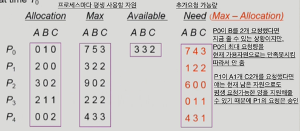

### Deadlock
- 일련의 프로세스들이 서로가 가진 자원을 기다리며 block된 상태
  - 여기서 자원은 HW, SW를 포함하는 개념으로, IO Device, CPU cycle, memory space, semaphore 등을 의미

### Deadlock 발생의 4가지 조건
1. Mutual exclusion : 매 순간 하나의 프로세스만이 자원을 사용할 수 있음
2. No preemption
3. Hold and wait : 자원을 가진 프로세스가 다른 자원을 기다릴 때 보유 자원을 놓지 않고 계속 가지고 있음
4. Circular wait : 자원을 기다리는 프로세스 간에 사이클이 형성되어야 함

### Resource-Allocation Graph(자원할당그래프)
- 현재 상황이 데드락인지 아닌지를 확인하기 위해 자원할당그래프를 이용
- 자원에서 프로세스쪽으로 나가는 화살표는, 프로세스가 자원을 획득했다는 의미
- 프로세스에서 자원쪽으로 나가는 화살표는, 프로세스가 자원을 요청했는데 아직 획득하지 못했다는 의미
- 그래프에 사이클이 없으면 데드락이 아니다.
- 그래프에 사이클이 있으면,
  - 자원마다 인스턴스가 하나 뿐이라면 무조건 데드락이다.
  - 자원마다 인스턴스가 여러 개라면, 상황에 따라 데드락일 수도 있고, 아닐 수도 있다.

### Deadlock의 처리 방법
1. Deadlock Prevention
   - 자원 할당 시 데드락의 4가지 필요 조건 중, 어느 하나가 만족되지 않도록 한다.
   - 데드락을 미연에 방지한다.
2. Deadlock Avoidance
   - 프로세스가 시작할 때, 평생에 걸쳐 필요로 하는 자원의 최대 갯수를 알 수 있다고 가정하고 시작
   - 자원 요청에 대한 부가적인 정보를 이용해서 데드락의 가능성이 없는 경우에만 자원을 할당한다.
   - 데드락을 미연에 방지한다.
3. Deadlock Detection and recovery
   - 데드락 발생은 허용하되 그에 대한 detection 루틴을 두어 deadlock 발견시 recover
   - 주로 시스템이 느려졌을 때, 혹시 데드락이 있는게 아닌가 detection하고 recovery한다.
   - 
4. Deadlock Ignorance
   - 데드락을 시스템이 책임지지 않아서 유저가 알아서 프로세스를 kill 해야 함
   - 데드락은 빈번히 발생하지 않기 때문에 데드락 방지를 위한 오버헤드를 갖지 않기 위함

### Deadlock Prevention
1. Mutual Exclusion : 이건 뭐 어떻게 할 수 없음
2. Hold and Wait : 프로세스가 자원을 요청할 때 다른 어떤 자원도 가지고 있지 않도록 만든다.
    a. 프로세스 시작 시 모든 필요한 자원을 할당받게 한다. -> 매 시점마다 필요로 하는 자원이 다를텐데, 처음부터 다 보유하고 실행하므로 비효율적
    b. 현재 고갈된 자원이 필요해 wait 상태에 들어가야 하는 경우, 이미 hold한 자원도 모두 놓고 기다린다.
3. No Preemption : P1을 실행하기 위해 P2가 보유한 자원이 필요한 경우, P2로부터 자원을 빼앗는다.
   - CPU와 같이 자원을 빼앗겨도 state를 save하여, 이후 다시 할당받았을 때 restore할 수 있는 자원에서 주로 사용한다.
4. Circular Wait : 자원마다 번호를 매겨서, 낮은 번호를 먼저 획득해야 높은 번호를 획득할 수 있도록 한다?
-> 2,3,4번 모두 데드락이 생기지도 않을 상황에서도 제약조건 때문에 자원을 비효율적으로 사용하게 된다.

### Deadlock Avoidance
- safe state와 unsafe state를 나눈다.
- safe state는 safe sequence가 하나라도 존재해야 한다.
  - sequence <P1, P2, ..., Pn>이 safe하려면 Pi의 자원 요청이 "현재 가용 자원 + 모든 Pj(j < i)의 보유 자원"에 의해 충족되어야 함
- unsafe state는 데드락의 가능성이 있는 상태이다.
- 시스템이 unsafe state에 들어가지 않는 것을 보장한다.
- Resource Allocation Graph 알고리즘
  - 자원마다 인스턴스가 하나밖에 없는 경우 사용
  - 프로세스가 평생에 적어도 한 번은 어떤 자원을 사용할 일이 있다면, 프로세스에서 자원으로 뻗는 점선 화살표를 긋는다.
    - 사실 데드락을 확인하기 위해선 그래프를 이용하는 것보다 테이블을 이용하는게 더 편하다.
  - 특정 프로세스의 자원 요청을 승낙했을 때, 실선과 점선을 포함해서 사이클이 만들어진다면, 자원의 여분이 있더라도 내어주지 않는다.
  - 프로스세 수가 n개일 때, 사이클 생성 여부를 조사하기 위해 O(n^2) 시간이 걸린다 (DFS)?
- Banker's 알고리즘
  - 자원마다 인스턴스가 여러 개인 경우 사용
  - 아래와 같은 테이블을 만들어서 프로세스의 자원 요청을 승낙할지 말지 판단한다. 

### Deadlock Detection and Recovery
- Detection
  - Wait-for graph 알고리즘
    - 자원마다 인스턴스가 하나밖에 없는 경우 사용
    - 자원할당 그래프의 변형 -> 프로세스만으로 node 구성
    - Wait-for graph에 사이클이 존재하는지 주기적으로 조사한다.
    - 프로세스가 n개일 때, 프로세스마다 최대 n-1개의 화살표가 생길 수 있으므로 최대 n(n-1)개의 화살표가 생긴다.
    - DFS나 BFS로 모든 화살표를 다 따라가보면 사이클 존재를 조사할 수 있다.
  - Banker's 알고리즘과 유사하게 테이블 활용
    - 자원마다 인스턴스가 여러 개 있는 경우 사용
    - 현재 자원을 요청하지 않은 프로세스는 추가적인 자원을 요청하기 전에 모든 자원을 반납할 것이라고 낙관적으로 가정
    - Banker's 알고리즘은 데드락이 생길 수 있는 가능성이 있는지 보는거였다면, 여기서는 데드락을 피할 수 있는 가능성이 있는지를 본다.
- Recovery
  - Prcoess termination
    1. 데드락에 연루된 모든 프로세스를 사살
    2. 데드락에 연루된 프로세스들을 하나씩 사살해보면서 데드락이 풀리는지 확인
  - Resource Preemption
    - 프로세스를 종료시키진 않고 자원만 뺏는다.
    - 비용을 최소화할 victim을 선정
    - safe state가 될 때까지 프로세스를 롤백시킨다.
    - 동일한 프로세스가 계속해서 victim으로 선정되는 경우 starvation 문제가 발생하므로, cost factor에 롤백 횟수도 같이 고려한다. 
