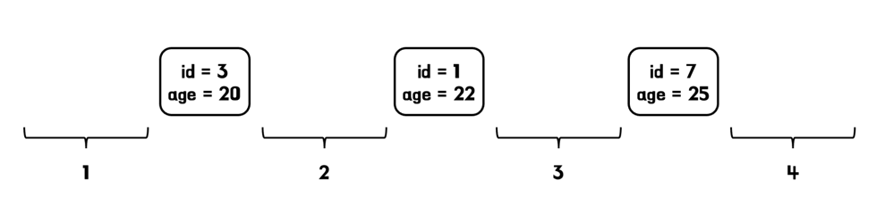

# 도커
### docker-compose.yml
- mysql 공식 이미지는 /docker-entrypoint-initdb.d/ 경로에 .sql 파일이 있으면 컨테이너가 처음 실행될 때 자동으로 적용된다.
  - 하지만 이미 데이터가 존재하는 컨테이너를 재시작할 경우, .sql은 실행되지 않는다.
```yml
services:
  db:
    image: mysql:8.0.28
    platform: linux/x86_64
    restart: always
    ports:
      - "23306:3306"
    environment:
      MYSQL_ROOT_PASSWORD: root
      MYSQL_USER: user
      MYSQL_PASSWORD: password
      TZ: Asia/Seoul
    volumes:
      - ./db/init:/docker-entrypoint-initdb.d

```

### ./db/init/init.sql
- 
```sql
CREATE DATABASE IF NOT EXISTS `roomescape`;
CREATE DATABASE IF NOT EXISTS `roomescape_test`;

CREATE USER 'test'@'%' IDENTIFIED BY 'test';
GRANT ALL PRIVILEGES ON `roomescape_test`.* TO 'test'@'%';

CREATE USER 'dev'@'%' IDENTIFIED BY 'dev';
GRANT ALL PRIVILEGES ON `roomescape`.* TO 'dev'@'%';

FLUSH PRIVILEGES;
```

### docker-compose 실행 명령어
- docker-compose -p roomescape up -d
  - -p : Docker Compose 프로젝트 이름 설정
    - 지정하지 않으면 현재 디렉터리의 이름이 프로젝트 이름이 됨
    - 동일한 docker-compose.yml을 사용하지만, 다른 프로젝트 이름을 사용해 여러 개의 독립적인 인스턴스를 실행할 수도 있음
  - -d : 백그라운드 실행으로 터미널을 점유하지 않음
    - 백그라운드에서 실행된 컨테이너의 로그를 확인하려면, docker-compose logs -f 명령어 사용


# 데드락
### 데드락 상황
```java
//Repository
@Lock(LockModeType.PESSIMISTIC_WRITE)
@QueryHints({@QueryHint(name = "jakarta.persistence.lock.timeout", value = "3000")})
boolean existsByDateAndTimeAndThemeAndStatus(LocalDate date, ReservationTime time, Theme theme, ReservationStatus status);

//Service
@Transactional
public Reservation create(Reservation reservation) {
    boolean existInSameTime = reservationRepository.existsByDateAndTimeAndThemeAndStatus(
            reservation.getDate(), reservation.getTime(), reservation.getTheme(), ReservationStatus.BOOKING);
    if (existInSameTime) {
        reservation.changeToWaiting();
    }
    return reservationRepository.save(reservation);
}

//TestCode
for (int i = 0; i < threadCount; i++) {
    int threadIndex = i;
    new Thread(() -> RestAssured.given()
            .contentType(ContentType.JSON)
            .cookie(cookies.get(threadIndex))
            .body(request).log().all()
            .when().post("/reservations/test")
            .then().log().all()
    ).start();
}
```
- 아래와 같은 쿼리를 수행하면 IX 락을 획득한다.
  - select r.id from reservation r where r.date = '2030-04-18' and r.time_id = 1 and r.theme_id = 1 and status = 'BOOKING' for update;
  - SELECT * FROM performance_schema.data_locks;
- tx1에서 select for update를 걸고, tx2에서 select for update를 건 뒤, tx1에서 insert를 수행하면 데드락 걸리네
  - Supremum pseudo-record 락이 걸리는 것이므로, tx1에서 select for update로 조회한 date, time_id, theme_id와 tx2에서 조회한 것이 완전히 다른 데이터여도 데드락 발생한다.
  - 더미 데이터가 존재하더라도, 같은 갭에 대해 갭 락을 동시에 획득하면 데드락 발생하나?
    - 인덱스가 없어도, 넥스트 키락 때문에 갭 락이 사용되는게 맞지?
    - 일단 존재하는 데이터에 대해 select for update를 tx1에서 수행하고, tx2에서 똑같이 시도하면, 레코드 락 때문에 당연하게도 락 대기 발생한다.
    - 존재하는 데이터에 대해 select for update를 tx1에 수행하는데 왜 Supremum pseudo-record 락을 획득하는 걸로 나올까? 
    - 아 모든 구간에 대해 락을 획득하니까... 근데 왜 1번 구간에 대한 락은 표기가 안 되지? -> 막상 1번 구간에 데이터 삽입을 시도하면 락 대기 걸림
    - 그럼 id = 1, id = 9이 있을 때, id = 5인 데이터 삽입도 락 대기 걸리려나? -> 걸림. 이름은 Supremum pseudo-record 락만 걸리는 것처럼 나와도 결국 모든 구간에 락 걸리는게 맞는 듯
    - 더미 데이터가 존재해도, tx1에서 select for update하면 tx2에서 select for update가 갭 락의 경우 가능 -> 끝 구간 획득 시도해보자.
      - 아... 갭 락을 획득하러 가는 길목에서 레코드 락을 획득해야 하니까 락 대기가 걸리는구나.
      - 1번 구간에 대해 select for update를 해도 사실 전체 테이블 스캔이 발생해서 tx2에서 모든 락을 획득하려 시도할테니까, 락 대기가 발생하겠다.
      - 그럼 이건 사실상 다른 슬롯에 대한 동시 예약 성능도 떨어뜨리니까 좋은 방법은 절대 아니겠다.
  - insert into reservation(member_id, date, time_id, theme_id, status) values(1, '2030-04-18', 1, 1, 'BOOKING'); 
  - 테스트 코드에서는 tx1에서 select for update를 걸고 insert를 수행하고 커밋 전에 tx2에서 select for update를 걸어서 tx2에서 데드락이 걸린거고
    - 그럼 tx1이 커밋하면 tx2가 락을 획득하며 정상진행되므로 데드락 상황이 아님.
  - tx1에서 select for update 없이 insert만 해도, tx2에서 select for update 하면 데드 락이 걸리는가?
    - 락 대기는 걸리는데, tx1이 커밋하면 데드 락은 아니다.

- 인덱스가 없는 상태에서, 데이터를 하나 추가해서 Supremum pseudo-record 락을 피하고, 갭 락을 사용하게 되면, 같은 date, time_id, theme_id가 아니더라도, 같은 갭에 속하면 X락 획득을 위해 대기가 필요할 듯? 테스트 해보자
  - 인덱스가 없으면 같은 갭에 속한다는 개념이 없다. 그냥 테이블 전체에 대해 락이 걸리는 것과 거의 똑같아지기 때문. 따라서 성능을 생각하면 절대 사용해서는 안 되는 방법인 것 같다.
- 인덱스가 있는 상황에서

# 낙낙 테크니컬라이팅
### 문제 상황
- 장소가 존재하지 않으면 추가하는 로직 -> 여러 스레드가 동시에 호출하면, 같은 장소가 중복저장될 수 있다.
- 장소를 검색할 때 S락을 걸면, 다른 트랜잭션에서 X락을 획득할 수 있으므로 동시성 문제를 해결할 수 있지 않을까? 
  - tx1이 S락을 획득하고, X락을 추가로 획득하기 전에 tx1이 S락을 먼저 획득하면, 데드락이 발생한다.
  - insert를 하면 자동으로 X락을 획득하는건가?
  - name, latitude, longitude 컬럼에 인덱스가 설정되어 있는지에 따라 데드락의 원인이 다소 달라진다.
    - 인덱스가 없는 경우 테이블 전체(정확히는 PK 인덱스 전체)에 락이 걸린다.
    - 인덱스가 있는 경우 갭 락이 발생한다.
- 장소를 검색할 때 X락을 걸어보자.
  - 참고 : 조회 시 X락을 거는 것은 동시성을 크게 저하시킬 수 있어 신중히 사용해야 한다.
  - 인덱스가 없으면서 && 테이블이 비어있지 않으면, 동시성 문제를 X락으로 해결할 수 있다.
    - 다만 다른 트랜잭션이 어떤 데이터를 삽입하려 해도 X락을 아예 획득할 수 없다는 점에서 성능 저하가 너무 심해, 동시성 문제를 해결했다고 보기는 힘들 듯?
  - name, latitude, longitude 컬럼에 인덱스를 걸면, tx1과 tx2가 동시에 갭락을 획득할 수 있으므로 데드락이 발생한다.

### 락과 인덱스의 관계
- mysql에서는 SQL문을 실행할 때 스캔되는 모든 인덱스 레코드에 락을 건다.
  - 하지만 SQL문 실행 시 인덱스의 레코드를 단 하나도 스캔하지 못한다면, mysql은 팬텀리드를 방지하기 위해 갭락(또는 Supremum pseudo-record 락)을 건다.
  - 아 MVCC를 이용하면 팬텀리드는 발생할 수 있고, 여기다가 갭락까지 사용하면 팬텀리드까지 방지할 수 있는거구나. 

### 갭 락과 Supremum pseudo-record 락
- 갭 락은 두 인덱스 레코드 사이의 간격에 대해 걸리는 락으로, 특정 구간에 새로운 레코드가 삽입되지 않도록 막는 락이다.
- 
  - SELECT * FROM ... WHERE age = 23 FOR UPDATE를 수행하면 3번 구간에 갭 락이 걸리게 되고, age = 23 뿐만 아니라 age = 24인 레코드도 삽입할 수 없게 된다.
    - 이를 통해 팬텀리드를 방지할 수 있다!
    - 동시성이 떨어지는 방식이라고 생각할 수 있지만, 이는 MySQL이 특정 컬럼 값에 대해서만 락을 걸지 못하기 때문이다.
    - MySQL의 락 메커니즘은 레코드 락과 갭 락을 조합하여 사용하므로 다소 비효율적으로 보이더라도 갭 락을 통해 팬텀 리드를 방지한다.
  - 4번 구간에 락을 걸고 싶다면, supremum pseudo-record 락이 필요하다!
  - supremum pseudo-record 락은 InnoDB 인덱스에서 가장 큰 레코드보다 큰 값이 삽입되지 않도록 막는 락
- 갭 락과 supremum pseudo-record 락은 공유가 가능하다.
  - 갭 락의 주 목적은 데이터를 삽입하는 것을 방지하는 것이기 때문에 서로 충돌하지 않고 공유가 가능하다.
  - 즉 insert가 되는 것만 막지, 같은 갭 락을 획득하는 것은 막지 않는다.
  - 따라서 X락을 걸어도 인덱스에 해당 레코드가 없다면 갭 락이 걸리게 되고, 이 갭 락은 여러 트랜잭션이 동시에 획득할 수 있어 데드락이 발생한다.
  - 앞서 보았듯이 (name, latitude, longitude) 컬럼에 인덱스가 없으면 데드락이 발생하지 않는다.
    - 이는 인덱스가 없는 경우 PK 인덱스를 스캔하기 때문이다.
    - PK 인덱스를 스캔할 때는 모든 범위를 스캔하기 때문에 전체에 락을 걸고, 따라서 여러 트랜잭션에 동시에 해당 락을 획득할 수 없다.
    - 좀 더 정확히는 각 레코드에 넥스트 키 락이 걸린다. 즉, 레코드 자체를 잠그는 레코드 락과 해당 레코드 왼쪽에 대한 삽입을 방지하는 갭 락이 동시에 걸린다.
      - 그냥 테이블 락을 걸어버리는 거랑 무슨 차이가 있는거지?
    - 레코드 락은 X락으로 설정될 때 서로 공유할 수 없기 때문에 위의 상황에서 데드락이 발생하지 않는다.
    - 하지만 테이블이 비어있으면 데드락이 발생한다.
      - PK 인덱스를 스캔해도 결과가 나오지 않게 되며, 이 때 supremum pseudo-record 락이 걸리면서 여러 트랜잭션이 동시에 락을 획득할 수 있게 되기 때문

### insert ignore로 해결?
insert ignore는 unique 제약조건에 의해 insert에 실패했을 때, 트랜잭션을 롤백하지 않고 warning만 띄워준다.

### 인덱스가 없는 상황에서 데드락이 발생하는 이유
- where 조건에 인덱스가 없으면, mysql은 PK로 인덱스 스캔하면서 거치는 모든 구간에 대해 락을 걸게 된다.
  - 이 때, 1번 구간 갭 락, 레코드 락, 레코드와 레코드 사이의 갭 락, supremum pseudo-record 락이 모두 걸린다.
  - 다만, SELECT * FROM performance_schema.data_locks; 조회하면 왜 갭 락은 조회가 안 되는지 추가 학습해볼 것
- 만약 테이블에 데이터가 하나도 없으면, 레코드 락 없이 supremum pseudo-record 락만 걸린다.
  - supremum pseudo-record 락은 갭 락의 일종이므로, X락 때문에 발생하더라도 여러 트랜잭션에서 공유가 가능하다.
  - tx1과 tx2에서 각각 supremum pseudo-record 락을 획득하면, tx1, tx2 모두 insert 작업이 불가능하게 되어 데드락이 발생한다.
- 테이블에 데이터가 하나라도 존재하면, 데드락이 발생하지 않는다.
  - tx1에서 select for update로 X락을 획득할 때 레코드 락을 획득한다.
  - tx2에서 select for update로 X락을 획득하려 시도하면, 레코드 락을 획득하지 못해 락 대기에 걸린다.
  - 하지만 중복 예약이 아닌 경우에도 tx1의 X락에 의해 tx2가 락 대기에 걸리므로 여러 사용자의 예약 처리에 문제가 생긴다.

### 인덱스가 있는 상황
- 테이블에 데이터가 하나도 없으면, 전체 구간에 대해 supremum pseudo-record 락이 걸리므로 데드락이 발생한다.
- 테이블에 데이터가 존재할 때,
  - tx1에서 select for update로 X락 갭 락을 획득하고, tx2에서 다른 구간에 대해 select for update로 x락 갭 락을 획득하면 문제가 없다. 
  - 하지만 tx1에서 select for update로 X락 갭 락을 획득하고, tx2에서 같은 구간에 대해 select for update로 x락 갭 락을 획득하면 데드락 발생한다.
  - 즉 데드락을 방지하기 위한 다른 방법이 필요하다.
  - 결국 unique 제약조건이 짱인 듯? -> 내꺼 기존 포트폴리오에서 락 관련 내용도 추가하면 좋겠다.
